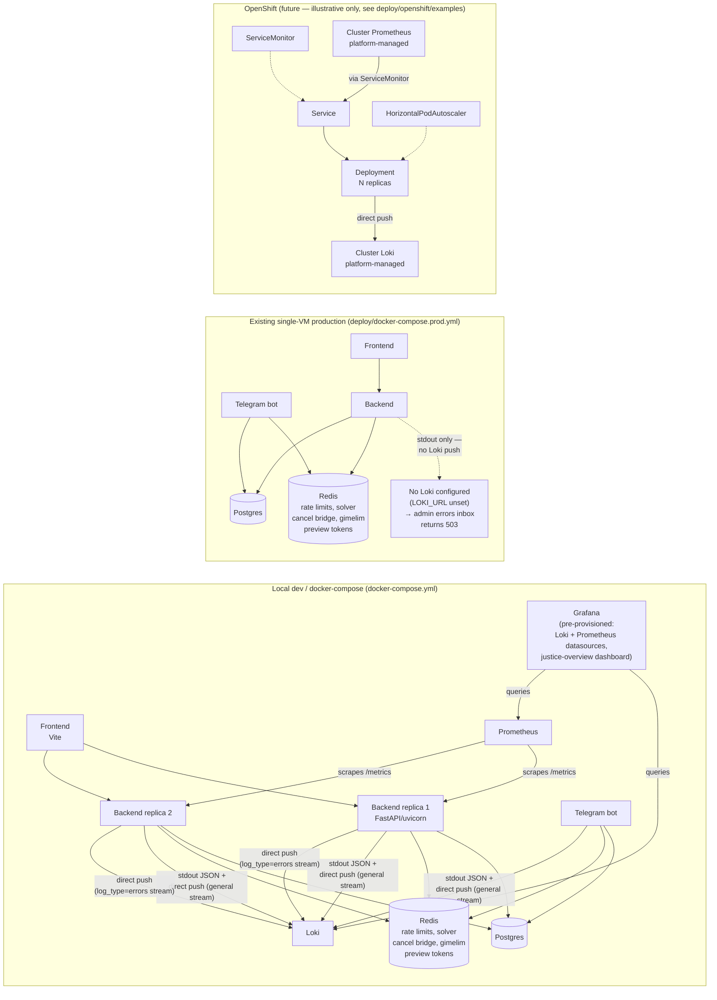

# Architecture

## Summary

The backend is now safe to run as N replicas (multiple uvicorn workers and/or
multiple containers behind a load balancer). Every piece of state that used
to live in process memory and would silently break — or silently multiply —
once a second replica joined has moved to Redis: rate-limit counters, the
CP-SAT solver's cross-replica cancellation signal, and gimelim preview
tokens. Logs no longer go to local disk; they stream to stdout and, when
`LOKI_URL` is configured, are pushed directly to Loki, with metrics scraped
by Prometheus and both visualized in Grafana. A dedicated audit sweep (Task
10 of the plan below) confirmed no other in-process mutable state needs
similar treatment — see
[`docs/superpowers/notes/2026-09-25-statelessness-audit-sweep.md`](superpowers/notes/2026-09-25-statelessness-audit-sweep.md).

This document describes the actual end state of that work, not the original
plan's assumptions — several details changed once implementation hit real
constraints (see "What moved to Redis, and why" and "Logging and
observability" below for specifics).

## Services diagram

## What moved to Redis, and why

| State | Where | Mechanism |
|---|---|---|
| Rate-limit counters | `backend/app/rate_limit.py` | `slowapi`/`limits`'s `Limiter(storage_uri=REDIS_URL)`. Without this, each uvicorn worker/replica keeps its own in-memory counters and the effective limit multiplies by process count. |
| Algorithm job cancellation | `backend/app/services/algorithm_bridge.py` | **Not** a full move to Redis. The CP-SAT solver's hot loop still polls a local `threading.Event` (a network round-trip on every hot-loop check was unacceptable). A cancel request is written to Redis (`SET algo_job_cancel:<job_id> ... EX 3600`) by whichever replica receives the cancel API call; a per-job daemon thread (`_watch_job_cancel_requested`) polls Redis at a coarse 0.5s interval and sets the local `threading.Event` once it sees the flag, bridging a cross-replica request into the in-process signal the solver actually watches. |
| Gimelim preview tokens | `backend/app/services/gimelim.py` | Replaced an in-memory dict with Redis `SETEX` (5-minute TTL, `gimelim_preview:<token>` key). A preview created on one replica must be committable by a follow-up request that lands on a different replica; Redis's own TTL also replaces the old manual lazy-expiry sweep. |

## Logging and observability

- **Local dev and the existing single-VM production deployment** both write
  structured JSON logs to stdout only — no more local log files
  (`backend/app/logging_config.py`). When `LOKI_URL` is set, logs are also
  pushed directly to Loki's HTTP push API from a background daemon thread
  inside the app process (not a DaemonSet/Promtail sidecar), so a slow or
  unreachable Loki can never block request handling — failures are swallowed
  and lines are dropped rather than the process stalling.
- **Errors get a dedicated stream.** The `backend.errors` and
  `frontend.errors` loggers push to Loki with an extra `log_type="errors"`
  label, on their own stream separate from the root logger's general INFO+
  firehose. `backend/app/error_logs.py`'s admin-errors query
  (`ERROR_STREAM_SELECTOR = '{app=~"justice-backend|justice-bot", log_type="errors"}'`)
  reads exactly that stream, so the admin inbox never has to filter a
  general-purpose log firehose down to just errors.
- **Query limits are Loki's real defaults, not unlimited.** The admin errors
  inbox only ever sees a 30-day window (`LOKI_MAX_QUERY_RANGE`) and up to
  5000 entries (`LOKI_MAX_ENTRIES`) — Loki's actual `max_query_length` /
  `max_entries_limit_per_query` defaults, not an app-chosen limit. Entries
  outside that window are invisible in the admin console; Grafana/Loki
  directly remain the place for deeper historical digging.
- **Admin errors "clear" is soft and per-admin, never a delete.** Clearing
  writes a `cleared_before` cursor to the `admin_error_clears` table
  (`AdminErrorClear` model); log data in Loki itself is never deleted, and
  each admin's clear only hides entries from their own view.
- **Loki/Prometheus/Grafana are dev-only.** They exist only in the root
  `docker-compose.yml`. `deploy/docker-compose.prod.yml` (the existing
  single-VM production deployment) has Redis (added by Task 1, alongside
  dev) but **no** Loki/Prometheus/Grafana services and no `LOKI_URL`
  configured.
- **Known, open gap: production has no error-log store today.** Because
  file-based logging was removed as part of this work, and production has no
  `LOKI_URL`, `backend/app/routes/admin_errors.py` now returns a deliberate
  HTTP 503 ("Error log store (Loki) is unavailable... LOKI_URL is not
  configured") from every admin-errors endpoint in production, instead of
  silently showing an empty inbox. This is a loud failure by design, not a
  regression that went unnoticed — but it is unresolved: **someone still
  needs to stand up a production Loki (or point `LOKI_URL` at one) before the
  admin errors inbox works in production again.** Until then, production
  errors are only visible via the process's stdout (e.g. `docker compose
  logs`), the same as before, minus the old file-based fallback.
- **Grafana in dev is pre-provisioned**, not something you configure by hand:
  `deploy/observability/grafana/provisioning/datasources/datasources.yml`
  declares the `Loki` and `Prometheus` datasources with explicit
  `uid: Loki` / `uid: Prometheus` (so dashboard JSON can reference them by a
  stable id), and one starter dashboard, `justice-overview`
  (`deploy/observability/grafana/dashboards/justice-overview.json`), is
  auto-loaded on startup.

## OpenShift (future)

`deploy/openshift/examples/` holds illustrative Kubernetes/OpenShift
manifests (`deployment.yaml`, `service.yaml`, `servicemonitor.yaml`,
`hpa.yaml`) for whoever eventually builds a real cluster deployment. They are
**not** meant to be applied as-is — see
[`deploy/openshift/examples/README.md`](../deploy/openshift/examples/README.md)
for the placeholders that need filling in (the real container image tag, a
real secret for `DATABASE_URL`/`REDIS_URL`, wherever `LOKI_URL` actually
points on that cluster, and confirming the Prometheus Operator CRDs exist
before applying the `ServiceMonitor`). Loki/Prometheus/Grafana themselves are
assumed to already exist on that cluster as platform-managed services, or to
be added by a future dedicated Kubernetes repo — this repo does not attempt
to configure them.

## Design spec

For the full design rationale (why Redis over alternatives, why direct-push
logging instead of a Promtail/DaemonSet, and the tradeoffs considered for
each piece), see
[`docs/superpowers/specs/2026-09-25-runtime-statelessness-observability-design.md`](superpowers/specs/2026-09-25-runtime-statelessness-observability-design.md).

## Protected object downloads

Browser file downloads use the same-origin `/api/file-download/` route through Nginx or Vite to the private file gateway. The gateway validates the Justice bearer token by calling the file-authorization service over verified mutual TLS. Only an allow decision permits the gateway to stream the object from S3-compatible storage. The browser never receives an S3 URL or storage credentials. The authorization listener and gateway are not published on host ports, and the internal authorization path is not proxied publicly. See [the file-storage migration runbook](operations/file-storage-migration.md) for rollout and rollback requirements.
