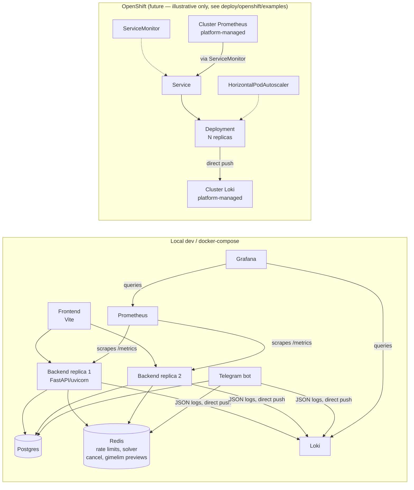

# Runtime Statelessness + Observability Implementation Plan

> **For agentic workers:** REQUIRED SUB-SKILL: Use superpowers:subagent-driven-development (recommended) or superpowers:executing-plans to implement this plan task-by-task. Steps use checkbox (`- [ ]`) syntax for tracking.

**Goal:** Make the backend safe to run as >1 replica/worker (shared state moves to Redis) and give it Loki/Prometheus/Grafana observability, testable end-to-end in the local dev stack, with the admin errors page reading from Loki instead of local files.

**Architecture:** Redis becomes the shared backend for everything that was previously an in-process dict/Event/counter (rate limiter, solver cancel signal, gimelim preview tokens). Logging switches from "write to a local file, read the file back" to "push JSON log lines straight to Loki over HTTP," which works the same whether the process runs via `dev.ps1`, docker-compose, or (later) an OpenShift pod. The admin errors page becomes a thin query layer over Loki. A new dev-only docker-compose stack (Loki, Prometheus, Grafana) makes all of this visible locally.

**Tech Stack:** FastAPI, SQLAlchemy, slowapi/`limits`, `redis` (redis-py), `httpx` (already a dependency, used for the Loki push/query HTTP calls — no new HTTP client added), `prometheus-fastapi-instrumentator`, Docker Compose, Grafana/Loki/Prometheus (official images), Alembic.

**Spec:** [docs/superpowers/specs/2026-09-25-runtime-statelessness-observability-design.md](../specs/2026-09-25-runtime-statelessness-observability-design.md)

## Global Constraints

- Logs reach Loki via direct HTTP push from the app (`POST /loki/api/v1/push`), never via a DaemonSet/Promtail — the OpenShift cluster's logging infra is outside this repo's control.
- No Promtail service anywhere in this plan.
- Shared runtime state (rate limiting, solver-cancel signal, gimelim preview tokens) moves to Redis, not to Postgres or any other store.
- The admin errors "clear" action becomes a soft, per-admin hide (a `cleared_before` cursor), never a real delete of log data.
- Grafana in the dev compose stack must be pre-provisioned via mounted config files (datasources + one starter dashboard) — no manual click-through setup required after `docker compose up`.
- Every task must leave the full test suite green — do not defer breakage to a later task.
- Follow existing code conventions exactly: `pydantic-settings` `Field(default=..., alias="ENV_VAR")` pattern in `app/settings.py`; `@lru_cache(maxsize=1)` singleton-factory pattern (as `get_settings()` already does); tests colocated the same way existing tests are (`app/services/tests/` for service-level tests next to the service they test — but this plan follows what's already established per file, see each task).

---

## Task 1: Redis infra — dependency, settings, docker-compose, dev.ps1, readiness probe

**Files:**
- Modify: `backend/pyproject.toml`
- Create: `backend/app/redis_client.py`
- Modify: `backend/app/settings.py`
- Modify: `backend/app/routes/health.py`
- Modify: `docker-compose.yml`
- Modify: `deploy/docker-compose.prod.yml`
- Modify: `.env.defaults`
- Modify: `dev.ps1`
- Test: `backend/app/tests/test_settings.py`
- Test: `backend/tests/unit/test_redis_client.py` (new)
- Test: `backend/tests/test_health.py` (new — no existing readiness test)
- Modify: `backend/tests/conftest.py` (session-scoped Redis test container + settings wiring, reused by every later task's tests)

**Interfaces:**
- Produces: `app.redis_client.get_redis() -> redis.Redis` — the one shared client every later task uses. Cached via `@lru_cache(maxsize=1)`, mirroring `get_settings()`.
- Produces: `Settings.redis_url: str` (alias `REDIS_URL`, default `"redis://localhost:6379/0"`).
- Produces (tests): `redis_container` (session-scoped pytest fixture yielding a `testcontainers.redis.RedisContainer`) and an autouse fixture that points `REDIS_URL` at it and flushes the DB between tests — every later task's Redis-backed tests depend on this existing.

- [ ] **Step 1: Add the `redis` runtime dependency and the `testcontainers` redis extra**

Edit `backend/pyproject.toml`:

```toml
dependencies = [
  "fastapi>=0.110",
  "ortools>=9.10",
  "uvicorn[standard]>=0.27",
  "sqlalchemy>=2.0.27",
  "alembic>=1.13",
  "psycopg[binary]>=3.1",
  "pydantic>=2.6",
  "pydantic-settings>=2.2",
  "argon2-cffi>=23.1",
  "python-jose[cryptography]>=3.3",
  "slowapi>=0.1.9",
  "redis>=5.0",
  "python-multipart>=0.0.9",
  "python-telegram-bot>=21.0",
  "openpyxl>=3.1",
  "holidays>=0.46",
  "jinja2>=3.1",
  "httpx>=0.27",
]
```

And in `[project.optional-dependencies].dev`, replace `"testcontainers[postgres]>=4.0",` with:

```toml
  "testcontainers[postgres,redis]>=4.0",
```

- [ ] **Step 2: Reinstall dependencies**

Run: `cd backend && pip install -e ".[dev]"`
Expected: installs `redis` and the redis testcontainers extra with no errors.

- [ ] **Step 3: Add `redis_url` to Settings**

Edit `backend/app/settings.py`, add alongside the other infra fields (after `cookie_secure`):

```python
    redis_url: str = Field(default="redis://localhost:6379/0", alias="REDIS_URL")
```

- [ ] **Step 4: Write the failing settings test**

Append to `backend/app/tests/test_settings.py`:

```python
def test_redis_url_defaults_to_localhost(monkeypatch):
    monkeypatch.delenv("REDIS_URL", raising=False)
    s = Settings(_env_file=None, DATABASE_URL="x", DB_ADMIN_URL="x", JWT_SECRET="x" * 32)
    assert s.redis_url == "redis://localhost:6379/0"


def test_redis_url_reads_from_env():
    s = Settings(
        _env_file=None, DATABASE_URL="x", DB_ADMIN_URL="x", JWT_SECRET="x" * 32,
        REDIS_URL="redis://redis:6379/0",
    )
    assert s.redis_url == "redis://redis:6379/0"
```

- [ ] **Step 5: Run to verify Step 4 passes (Settings change is trivial, but confirm)**

Run: `pytest app/tests/test_settings.py -v`
Expected: PASS (4 tests total incl. the 2 pre-existing `hr_sync_enabled` ones).

- [ ] **Step 6: Create the shared Redis client module**

Create `backend/app/redis_client.py`:

```python
"""Shared Redis client factory.

One process-wide client (redis-py pools connections internally, so this is
not "one connection" — it's the same singleton-factory pattern as
app.settings.get_settings()). Every piece of state that used to live in a
module-level dict/Event goes through this so it's visible across replicas
and worker processes instead of being pinned to whichever one happened to
handle a given request.
"""
from __future__ import annotations

from functools import lru_cache

import redis

from app.settings import get_settings


@lru_cache(maxsize=1)
def get_redis() -> redis.Redis:
    return redis.Redis.from_url(get_settings().redis_url, decode_responses=True)
```

- [ ] **Step 7: Add the session-scoped Redis test container + autouse wiring**

Edit `backend/tests/conftest.py`. Add the import near the existing `from testcontainers.postgres import PostgresContainer`:

```python
from testcontainers.redis import RedisContainer
```

Add these fixtures (near `pg_container`/`db_admin_url`):

```python
@pytest.fixture(scope="session")
def redis_container() -> Iterator[RedisContainer]:
    with RedisContainer("redis:7-alpine") as redis_c:
        yield redis_c


@pytest.fixture(scope="session", autouse=True)
def _configure_redis_settings(redis_container: RedisContainer, monkeypatch_session: "MonkeyPatch") -> None:
    """Point every test at the throwaway Redis container instead of whatever
    REDIS_URL is set to in the developer's own environment."""
    from app.settings import get_settings

    host = redis_container.get_container_host_ip()
    port = redis_container.get_exposed_port(6379)
    monkeypatch_session.setenv("REDIS_URL", f"redis://{host}:{port}/0")
    get_settings.cache_clear()


@pytest.fixture(autouse=True)
def _flush_redis() -> Iterator[None]:
    """Test isolation: every test starts with an empty Redis DB."""
    from app.redis_client import get_redis

    get_redis().flushdb()
    yield
```

`monkeypatch_session` is a session-scoped `MonkeyPatch` — check whether `tests/conftest.py` already defines one (search for `monkeypatch_session` before adding a duplicate). If it doesn't exist yet, add it right above `_configure_redis_settings`:

```python
@pytest.fixture(scope="session")
def monkeypatch_session() -> Iterator[pytest.MonkeyPatch]:
    mp = pytest.MonkeyPatch()
    yield mp
    mp.undo()
```

- [ ] **Step 8: Write the failing redis_client test**

Create `backend/tests/unit/test_redis_client.py`:

```python
from app.redis_client import get_redis


def test_get_redis_returns_working_client():
    client = get_redis()
    client.set("test_redis_client:ping", "pong")
    assert client.get("test_redis_client:ping") == "pong"


def test_get_redis_is_cached():
    assert get_redis() is get_redis()
```

- [ ] **Step 9: Run to verify it passes**

Run: `pytest tests/unit/test_redis_client.py -v`
Expected: PASS. If it fails to connect, confirm Docker is running (testcontainers needs it) and re-run.

- [ ] **Step 10: Add Redis to dev docker-compose**

Edit `docker-compose.yml`, add after the `db` service:

```yaml
  redis:
    image: redis:7-alpine
    ports:
      - "6379:6379"
    volumes:
      - ./.docker-data/redis:/data
    healthcheck:
      test: ["CMD", "redis-cli", "ping"]
      interval: 5s
      timeout: 5s
      retries: 10
```

Add `redis:\n        condition: service_healthy` to the `backend` and `telegram-bot` services' existing `depends_on` blocks (alongside `db`).

- [ ] **Step 11: Add Redis to the prod docker-compose**

Edit `deploy/docker-compose.prod.yml`, add after the `db` service:

```yaml
  redis:
    image: redis:7-alpine
    restart: unless-stopped
    volumes:
      - /opt/justice/redis-data:/data
    healthcheck:
      test: ["CMD", "redis-cli", "ping"]
      interval: 5s
      timeout: 5s
      retries: 10
```

Add `redis:\n        condition: service_healthy` to the `backend` and `telegram-bot` services' `depends_on` blocks. Update the prerequisites comment at the top of the file to add: `#   - Create dirs: ... /opt/justice/redis-data`.

- [ ] **Step 12: Add REDIS_URL to `.env.defaults`**

Edit `.env.defaults`, add under the `# Backend` section, after `COOKIE_SECURE`:

```
REDIS_URL=redis://redis:6379/0
```

- [ ] **Step 13: Wire REDIS_URL into dev.ps1's native-process flow**

Edit `dev.ps1`. Next to the existing DB URL rewrite (around line 28), add:

```powershell
$localRedisUrl = $envVars['REDIS_URL'] -replace '@redis:', '@localhost:'
```

Change the "Start only the DB" section (`docker compose up db -d`) to also start Redis:

```powershell
Write-Host "[dev] Starting DB + Redis containers..." -ForegroundColor Cyan
$dbOut = docker compose up db redis -d 2>&1
```

After the existing DB health-wait loop, add an equivalent one for Redis:

```powershell
Write-Host "[dev] Waiting for Redis to be healthy..." -ForegroundColor Cyan
$redisContainer = docker compose ps -q redis
for ($i = 0; $i -lt 30; $i++) {
    $redisHealth = docker inspect --format '{{.State.Health.Status}}' $redisContainer 2>$null
    if ($redisHealth -eq "healthy") { break }
    Start-Sleep -Seconds 1
}
if ($redisHealth -ne "healthy") { Write-Error "Redis did not become healthy in time."; exit 1 }
Write-Host "[dev] Redis ready." -ForegroundColor Green
```

In the "Run migrations against localhost" section, alongside `$env:DATABASE_URL = $localDbUrl`, add:

```powershell
$env:REDIS_URL = $localRedisUrl
```

(This makes `REDIS_URL` available to the `concurrently`-launched native backend/bot processes for the rest of the script, the same way `DATABASE_URL` already is.)

- [ ] **Step 14: Manually verify the compose changes**

Run: `docker compose config` (validates YAML/interpolation without starting anything)
Expected: no errors, `redis` service appears in the rendered config.

Run: `docker compose up redis -d && docker compose exec redis redis-cli ping`
Expected: `PONG`. Then `docker compose down`.

- [ ] **Step 15: Add a Redis check to the readiness probe**

Edit `backend/app/routes/health.py`:

```python
from fastapi import APIRouter, Depends
from sqlalchemy import text
from sqlalchemy.orm import Session
from starlette.responses import JSONResponse

from app.db.session import get_session
from app.redis_client import get_redis

router = APIRouter(prefix="/health", tags=["health"])


@router.get("/live")
def liveness() -> dict[str, str]:
    """Liveness probe — no external deps. Returns 200 if process is alive."""
    return {"status": "alive"}


@router.get("/ready")
def readiness(session: Session = Depends(get_session)) -> JSONResponse:
    """Readiness probe — checks DB and Redis. Returns 503 if either is down."""
    try:
        session.execute(text("SELECT 1"))
        get_redis().ping()
        return JSONResponse({"status": "ready"})
    except Exception as exc:
        return JSONResponse({"status": "not_ready", "error": str(exc)}, status_code=503)


@router.get("")
def health(session: Session = Depends(get_session)) -> dict[str, str]:
    """Legacy health endpoint — kept for backward compatibility."""
    session.execute(text("SELECT 1"))
    return {"status": "ok"}
```

- [ ] **Step 16: Write the failing readiness test**

Create `backend/tests/test_health.py`:

```python
from fastapi.testclient import TestClient


def test_health_returns_ok(client: TestClient):
    r = client.get("/api/health")
    assert r.status_code == 200
    assert r.json() == {"status": "ok"}


def test_liveness_returns_alive(client: TestClient):
    r = client.get("/api/health/live")
    assert r.status_code == 200
    assert r.json() == {"status": "alive"}


def test_readiness_returns_ready_when_db_and_redis_are_up(client: TestClient):
    r = client.get("/api/health/ready")
    assert r.status_code == 200
    assert r.json() == {"status": "ready"}


def test_readiness_returns_503_when_redis_is_down(client: TestClient, monkeypatch):
    import redis as redis_module

    from app import redis_client

    class _BrokenRedis:
        def ping(self):
            raise redis_module.ConnectionError("simulated outage")

    monkeypatch.setattr(redis_client, "get_redis", lambda: _BrokenRedis())
    r = client.get("/api/health/ready")
    assert r.status_code == 503
    assert r.json()["status"] == "not_ready"
```

Note: there is an existing `tests/test_health.py`-shaped test for the plain `/api/health` route somewhere under a different name (search `find . -iname "*test_health*"` before creating — if `test_health_returns_ok` already exists elsewhere, don't duplicate it; add only the two new readiness tests to that existing file instead).

- [ ] **Step 17: Run to verify it passes**

Run: `pytest tests/test_health.py -v` (or wherever the health test file actually ended up per Step 16's note)
Expected: PASS, 4 tests.

- [ ] **Step 18: Run the full fast suite**

Run: `pytest -q`
Expected: PASS, no regressions.

- [ ] **Step 19: Commit**

```bash
git add backend/pyproject.toml backend/app/redis_client.py backend/app/settings.py \
        backend/app/routes/health.py backend/app/tests/test_settings.py \
        backend/tests/unit/test_redis_client.py backend/tests/test_health.py \
        backend/tests/conftest.py docker-compose.yml deploy/docker-compose.prod.yml \
        .env.defaults dev.ps1
git commit -m "feat: add Redis infra (client, settings, compose, dev.ps1, readiness probe)"
```

---

## Task 2: Rate limiter — Redis-backed storage

**Files:**
- Modify: `backend/app/rate_limit.py`
- Test: `backend/tests/integration/test_login_rate_limit.py` (existing — verify still passes unchanged)
- Test: `backend/tests/unit/test_rate_limit_storage.py` (new)

**Interfaces:**
- Consumes: `app.settings.get_settings().redis_url` (Task 1).
- Produces: `app.rate_limit.limiter` unchanged in shape (still a `slowapi.Limiter`, still has `.reset()`), only its storage backend changes — every existing caller (`app.main`, `app.routes.auth`, `app.routes.invite_codes`, etc.) needs no changes.

- [ ] **Step 1: Write the failing test proving cross-instance sharing**

Create `backend/tests/unit/test_rate_limit_storage.py`:

```python
"""The whole point of this change: two independent Limiter instances backed
by the same Redis must share their counters, proving rate limits now work
across replicas/workers instead of being per-process."""
from slowapi import Limiter
from slowapi.util import get_remote_address

from app.settings import get_settings


def _make_limiter() -> Limiter:
    return Limiter(key_func=get_remote_address, storage_uri=get_settings().redis_url)


def test_two_limiter_instances_share_redis_backed_counters():
    limiter_a = _make_limiter()
    limiter_b = _make_limiter()

    @limiter_a.limit("2/minute")
    def endpoint_a(request):
        return "ok"

    class _FakeRequest:
        headers: dict = {}
        client = type("c", (), {"host": "9.9.9.9"})()

    request = _FakeRequest()
    endpoint_a(request=request)
    endpoint_a(request=request)

    # A third call against limiter_a is over budget...
    try:
        endpoint_a(request=request)
        raised = False
    except Exception:
        raised = True
    assert raised

    # ...and a fresh Limiter instance pointed at the same Redis key already
    # sees the same client as exhausted, which a MemoryStorage-backed
    # instance never would.
    stats = limiter_b.limiter.get_window_stats("2 per 1 minute", "9.9.9.9")
    assert stats.remaining == 0
```

- [ ] **Step 2: Run to verify it fails**

Run: `pytest tests/unit/test_rate_limit_storage.py -v`
Expected: FAIL — `limiter_b` (a fresh `Limiter()` with default `MemoryStorage`, since `app.rate_limit.limiter` doesn't pass `storage_uri` yet) has no record of `limiter_a`'s calls. Adjust the assertion if `limits`' exact API for `get_window_stats` differs from what's guessed above — check `import limits; help(limits.strategies.FixedWindowRateLimiter.get_window_stats)` in a Python shell against the installed version first, and use whatever it actually returns instead of assuming `.remaining`.

- [ ] **Step 3: Point the real limiter at Redis**

Edit `backend/app/rate_limit.py`:

```python
from slowapi import Limiter
from slowapi.util import get_remote_address

from app.settings import get_settings

# headers_enabled: slowapi's default RateLimitExceeded handler only sets
# Retry-After when this is on; without it, the header is silently omitted
# and the frontend has no way to display a real countdown.
#
# storage_uri=Redis: without this, `limits` defaults to an in-process
# MemoryStorage, so rate limits only apply per-process — a second uvicorn
# worker or a second replica gets its own independent counters and the
# limit effectively multiplies by however many processes are running.
limiter = Limiter(
    key_func=get_remote_address, headers_enabled=True, storage_uri=get_settings().redis_url,
)
```

- [ ] **Step 4: Run to verify Step 1's test passes**

Run: `pytest tests/unit/test_rate_limit_storage.py -v`
Expected: PASS.

- [ ] **Step 5: Run the existing login rate-limit integration tests**

Run: `pytest tests/integration/test_login_rate_limit.py -v`
Expected: PASS unchanged — these already call `limiter.reset()` in a `finally` block, and `limits`' `RedisStorage.reset()` flushes the whole Redis DB the same way `MemoryStorage.reset()` cleared its dict, so no test changes are needed here. If `reset()` raises `NotImplementedError` on the installed `limits` version instead, replace both `limiter.reset()` calls in that file with `from app.redis_client import get_redis; get_redis().flushdb()` and note that substitution in this task's commit message.

- [ ] **Step 6: Run the full fast suite**

Run: `pytest -q`
Expected: PASS.

- [ ] **Step 7: Commit**

```bash
git add backend/app/rate_limit.py backend/tests/unit/test_rate_limit_storage.py
git commit -m "fix: back the rate limiter with Redis instead of per-process memory"
```

---

## Task 3: Solver cancellation — Redis-bridged across replicas

**Files:**
- Modify: `backend/app/services/algorithm_bridge.py`
- Modify: `backend/app/routes/algorithm.py`
- Test: `backend/app/services/tests/test_algorithm_bridge.py` (existing — add cases)

**Interfaces:**
- Consumes: `app.redis_client.get_redis()` (Task 1).
- Produces: `request_job_cancellation(job_id: uuid.UUID) -> None` and `_is_cancellation_requested(job_id: uuid.UUID) -> bool` in `app.services.algorithm_bridge` — `app.routes.algorithm.cancel_job` calls the former.
- Keeps: `_cancel_events: dict[str, threading.Event]` as-is (same-process fast path), `run_algorithm_job(job_id, actor_id)` signature unchanged.

The CP-SAT solver polls `cancel_event.is_set()` synchronously, potentially thousands of times during a solve — that must stay a pure in-memory check with zero network latency. So the fix is not "replace the dict with Redis calls everywhere"; it's "keep the local `threading.Event` for the hot loop, and add a coarse-interval bridge thread that translates a cross-replica cancel request (in Redis) into a local `.set()` call."

- [ ] **Step 1: Write the failing test for the Redis bridge**

Add to `backend/app/services/tests/test_algorithm_bridge.py`:

```python
import threading
import time

from app.services.algorithm_bridge import (
    _is_cancellation_requested,
    _watch_job_cancel_requested,
    request_job_cancellation,
)


def test_request_job_cancellation_is_visible_via_is_cancellation_requested():
    job_id = uuid4()
    assert _is_cancellation_requested(job_id) is False
    request_job_cancellation(job_id)
    assert _is_cancellation_requested(job_id) is True


def test_watch_job_cancel_requested_sets_local_event_when_redis_flag_appears():
    job_id = uuid4()
    cancel_event = threading.Event()
    watcher = threading.Thread(
        target=_watch_job_cancel_requested, args=(job_id, cancel_event), daemon=True,
    )
    watcher.start()

    assert cancel_event.wait(timeout=0.3) is False  # nothing requested yet

    request_job_cancellation(job_id)

    assert cancel_event.wait(timeout=2.0) is True  # bridged within one poll interval
    watcher.join(timeout=1.0)
```

(`uuid4` is already imported at the top of this test file — check before adding a duplicate import.)

- [ ] **Step 2: Run to verify it fails**

Run: `pytest app/services/tests/test_algorithm_bridge.py -k cancel_requested -v`
Expected: FAIL with `ImportError: cannot import name 'request_job_cancellation'`.

- [ ] **Step 3: Add the Redis-bridged cancellation helpers**

Edit `backend/app/services/algorithm_bridge.py`. Near the existing `_cancel_events` declaration and `_watch_job_timeout` function:

```python
_cancel_events: dict[str, threading.Event] = {}
_logger = logging.getLogger(__name__)

_CANCEL_KEY_PREFIX = "algo_job_cancel:"
_CANCEL_KEY_TTL_SECONDS = 3600  # long enough to outlive any single job run
_CANCEL_POLL_SECONDS = 0.5


def request_job_cancellation(job_id: uuid.UUID) -> None:
    """Mark a job as cancel-requested in Redis, visible to whichever replica
    is actually running it (which may not be the one handling this request)."""
    from app.redis_client import get_redis

    get_redis().set(f"{_CANCEL_KEY_PREFIX}{job_id}", "1", ex=_CANCEL_KEY_TTL_SECONDS)


def _is_cancellation_requested(job_id: uuid.UUID) -> bool:
    from app.redis_client import get_redis

    return bool(get_redis().exists(f"{_CANCEL_KEY_PREFIX}{job_id}"))


def _clear_cancellation_request(job_id: uuid.UUID) -> None:
    from app.redis_client import get_redis

    get_redis().delete(f"{_CANCEL_KEY_PREFIX}{job_id}")


def _watch_job_cancel_requested(job_id: uuid.UUID, cancel_event: threading.Event) -> None:
    """Daemon thread: bridges a cross-replica cancel request into the local
    threading.Event the solver's hot loop polls in-process. Polling Redis
    directly from that hot loop would add a network round-trip to every
    check inside the solve; this thread absorbs that cost at a coarse
    interval instead, so the solver itself never talks to Redis."""
    while not cancel_event.wait(timeout=_CANCEL_POLL_SECONDS):
        if _is_cancellation_requested(job_id):
            _logger.warning("[job %s] cancel_event set via Redis cancel request", job_id)
            cancel_event.set()
            return
```

- [ ] **Step 4: Run to verify Step 1's tests pass**

Run: `pytest app/services/tests/test_algorithm_bridge.py -k cancel_requested -v`
Expected: PASS.

- [ ] **Step 5: Wire the bridge thread into `run_algorithm_job`**

Edit `backend/app/services/algorithm_bridge.py` at the existing:

```python
    cancel_event = threading.Event()
    _cancel_events[str(job_id)] = cancel_event
```

Change to:

```python
    cancel_event = threading.Event()
    _cancel_events[str(job_id)] = cancel_event  # same-replica fast path — see cancel_job
    threading.Thread(
        target=_watch_job_cancel_requested, args=(job_id, cancel_event), daemon=True,
    ).start()
```

And at the existing `finally` block:

```python
    finally:
        _cancel_events.pop(str(job_id), None)
```

Change to:

```python
    finally:
        _cancel_events.pop(str(job_id), None)
        _clear_cancellation_request(job_id)
```

- [ ] **Step 6: Update the cancel route to fall back to Redis**

Edit `backend/app/routes/algorithm.py` at the existing:

```python
    from app.services.algorithm_bridge import _cancel_events
    event = _cancel_events.get(str(job_id))
    if event:
        _logger.warning("[job %s] cancel_event set by user request (actor=%s)", job_id, user.id)
        event.set()
```

Change to:

```python
    from app.services.algorithm_bridge import _cancel_events, request_job_cancellation
    event = _cancel_events.get(str(job_id))
    if event:
        # Same replica is running the job — set it directly, no need to wait
        # out a Redis poll interval.
        _logger.warning("[job %s] cancel_event set by user request (actor=%s)", job_id, user.id)
        event.set()
    else:
        # A different replica may be running it — always also write the
        # Redis flag so that replica's watcher thread picks it up.
        request_job_cancellation(job_id)
```

- [ ] **Step 7: Write the failing end-to-end cancellation test**

Add to `backend/app/services/tests/test_algorithm_bridge.py` (find the existing job-running test fixture/helper used by other tests in this file for constructing a minimal `AlgorithmJob` row, and reuse it rather than inventing a new one):

```python
def test_run_algorithm_job_honors_cross_replica_cancel_request(admin_session, monkeypatch):
    """Simulates cancel_job() being handled on a different replica than the
    one running the solver: it can only reach the job via Redis, not the
    local _cancel_events dict."""
    import threading
    import time

    from app.services.algorithm_bridge import _cancel_events, request_job_cancellation

    job_id = uuid4()
    cancel_event = threading.Event()

    def fake_run(*args, **kwargs):
        _cancel_events[str(job_id)] = cancel_event
        watcher = threading.Thread(
            target=__import__("app.services.algorithm_bridge", fromlist=["_watch_job_cancel_requested"])._watch_job_cancel_requested,
            args=(job_id, cancel_event), daemon=True,
        )
        watcher.start()
        request_job_cancellation(job_id)  # the "other replica"'s request
        assert cancel_event.wait(timeout=2.0)
        _cancel_events.pop(str(job_id), None)

    fake_run()
```

(This test exercises the same building blocks as Step 1's tests but through the exact call sequence `run_algorithm_job` performs, without needing to run the actual CP-SAT solver — check the existing tests in this file for a helper that already stubs out the solve step, and use that instead of `fake_run` if one exists, since duplicating the real `run_algorithm_job` call is preferable if it's cheap to set up.)

- [ ] **Step 8: Run to verify it passes**

Run: `pytest app/services/tests/test_algorithm_bridge.py -k cross_replica -v`
Expected: PASS.

- [ ] **Step 9: Run the full fast suite**

Run: `pytest -q`
Expected: PASS.

- [ ] **Step 10: Commit**

```bash
git add backend/app/services/algorithm_bridge.py backend/app/routes/algorithm.py \
        backend/app/services/tests/test_algorithm_bridge.py
git commit -m "fix: bridge algorithm job cancellation across replicas via Redis"
```

---

## Task 4: Gimelim preview store — Redis-backed

**Files:**
- Modify: `backend/app/services/gimelim.py`
- Modify: `backend/tests/unit/test_gimelim_service.py`

**Interfaces:**
- Consumes: `app.redis_client.get_redis()` (Task 1).
- Produces: `_load_preview(token: str) -> dict[str, Any] | None` (replaces direct `_PREVIEW_STORE[token]` access used by tests). `preview_gimelim`, `consume_preview_token`, `resolve_preview_token_assignment`, `commit_gimelim` keep their existing signatures.
- Removes: `_PREVIEW_STORE` module dict and the manual lazy-expiry sweep — Redis's own `SETEX` TTL replaces both.

- [ ] **Step 1: Replace the in-memory store with Redis-backed helpers**

Edit `backend/app/services/gimelim.py`. Replace:

```python
# ── In-process preview token store ──────────────────────────────────────────
# Maps token (str UUID) → (expires_at, preview_payload dict)
_PREVIEW_STORE: dict[str, tuple[datetime, dict[str, Any]]] = {}
_TOKEN_TTL_SECONDS = 300  # 5 minutes
```

with:

```python
# ── Preview token store (Redis) ─────────────────────────────────────────────
# A gimelim preview must be visible to whichever replica handles the
# follow-up commit request, which may not be the one that created it — so
# this can't be a module-level dict. Redis's own TTL (via SETEX) replaces
# the manual lazy-expiry sweep the old in-memory version needed.
_TOKEN_TTL_SECONDS = 300  # 5 minutes
_PREVIEW_KEY_PREFIX = "gimelim_preview:"


def _preview_key(token: str) -> str:
    return f"{_PREVIEW_KEY_PREFIX}{token}"


def _store_preview(token: str, payload: dict[str, Any]) -> None:
    from app.redis_client import get_redis

    get_redis().setex(_preview_key(token), _TOKEN_TTL_SECONDS, json.dumps(payload, default=str))


def _load_preview(token: str) -> dict[str, Any] | None:
    from app.redis_client import get_redis

    raw = get_redis().get(_preview_key(token))
    return json.loads(raw) if raw is not None else None
```

Add `import json` to the top of the file if it isn't already imported (check first — the file already imports `dataclass`, `date`, etc. from `dataclasses`/`datetime`; `json` is likely new).

- [ ] **Step 2: Replace the store-and-cleanup call site**

Find (in `preview_gimelim`, around the `payload = {...}` block ending in `"future_c_status_snapshot": ...`):

```python
    _PREVIEW_STORE[token] = (expires_at, payload)

    # Clean up expired tokens (lazy cleanup)
    now = datetime.now(timezone.utc)
    expired = [k for k, (exp, _) in _PREVIEW_STORE.items() if exp < now]
    for k in expired:
        del _PREVIEW_STORE[k]
```

Replace with:

```python
    _store_preview(token, payload)
```

(`expires_at` is still computed earlier in the function for the `GimelimPreview.preview_token_expires_at` response field — that part is untouched; only the storage and the now-unnecessary manual sweep changes.)

- [ ] **Step 3: Replace `consume_preview_token`**

```python
def consume_preview_token(preview_token: str) -> None:
    """Remove a preview token after its commit has been durably persisted.

    Callers must only invoke this once session.commit() has succeeded — see
    commit_gimelim's docstring note on why the token isn't consumed there.
    """
    from app.redis_client import get_redis

    get_redis().delete(_preview_key(preview_token))
```

- [ ] **Step 4: Replace `resolve_preview_token_assignment`**

```python
def resolve_preview_token_assignment(preview_token: str) -> uuid.UUID | None:
    """Return the primary_assignment_id stored in a valid (non-expired) preview token.

    Returns None if the token is unknown or expired, without consuming it.
    """
    payload = _load_preview(preview_token)
    if payload is None:
        return None
    raw = payload.get("primary_assignment_id")
    if not raw:
        return None
    return uuid.UUID(raw)
```

- [ ] **Step 5: Replace the lookup in `commit_gimelim`**

Find:

```python
    entry = _PREVIEW_STORE.get(preview_token)
    if entry is None:
        raise GimelimError("token_not_found")
    expires_at, payload = entry
    if expires_at < now:
        del _PREVIEW_STORE[preview_token]
        raise GimelimError("token_expired")

    if str(shift_id) != payload["shift_id"]:
        raise GimelimError("token_shift_mismatch")
```

Replace with:

```python
    payload = _load_preview(preview_token)
    if payload is None:
        # Redis's TTL already evicted expired tokens, so "expired" and
        # "never existed" collapse into one case — routes/gimelim.py
        # surfaces GimelimError's message as-is and neither the frontend
        # nor any test distinguished the two previously.
        raise GimelimError("token_not_found")

    if str(shift_id) != payload["shift_id"]:
        raise GimelimError("token_shift_mismatch")
```

Remove the now-unused `now = datetime.now(timezone.utc)` line a few lines above this block if nothing else in `commit_gimelim` still uses that particular `now` — check the rest of the function body first (it's likely still used for the "re-read assignments" race-condition check below; if so, leave it).

- [ ] **Step 6: Update the two resolve_preview_token_assignment / preview reader call sites if any use expiry directly**

Search: `grep -n "expires_at" backend/app/services/gimelim.py backend/app/routes/gimelim.py` — confirm no remaining reference to the removed `_PREVIEW_STORE`-tuple's `expires_at` outside of the `preview_gimelim` response construction (which is untouched). Fix any stragglers found.

- [ ] **Step 7: Update the test file's direct store access**

Edit `backend/tests/unit/test_gimelim_service.py`. There are 7 call sites importing `_PREVIEW_STORE` directly — replace each:

Lines ~241-242, ~269-270, ~296-297, ~370-371, ~402-403 (all the same shape):

```python
    from app.services.gimelim import _PREVIEW_STORE
    _, payload = _PREVIEW_STORE[token_entry]
```

become:

```python
    from app.services.gimelim import _load_preview
    payload = _load_preview(token_entry)
```

(substituting `token_entry` for whatever variable name each site actually uses — `preview.preview_token` in most of them, per the file as currently read).

Lines ~487-488 and ~490-491 (inside `test_commit_full_flow`):

```python
    from app.services.gimelim import _PREVIEW_STORE, consume_preview_token
    assert preview.preview_token in _PREVIEW_STORE

    consume_preview_token(preview.preview_token)
    assert preview.preview_token not in _PREVIEW_STORE
```

become:

```python
    from app.services.gimelim import _load_preview, consume_preview_token
    assert _load_preview(preview.preview_token) is not None

    consume_preview_token(preview.preview_token)
    assert _load_preview(preview.preview_token) is None
```

Lines ~538-539 (inside `test_commit_does_not_consume_token_on_its_own`):

```python
    from app.services.gimelim import _PREVIEW_STORE
    assert preview.preview_token in _PREVIEW_STORE, (
        "commit_gimelim must not consume the token itself — that's the caller's "
        "responsibility, only after its session.commit() actually succeeds"
    )
```

becomes:

```python
    from app.services.gimelim import _load_preview
    assert _load_preview(preview.preview_token) is not None, (
        "commit_gimelim must not consume the token itself — that's the caller's "
        "responsibility, only after its session.commit() actually succeeds"
    )
```

- [ ] **Step 8: Run the gimelim test files**

Run: `pytest tests/unit/test_gimelim_service.py app/services/tests/test_gimelim.py tests/integration/test_gimelim_api.py -v`
Expected: PASS, no failures. `test_commit_raises_on_expired_token` (which already expects `token_not_found` for a nonexistent token) should be unaffected.

- [ ] **Step 9: Run the full fast suite**

Run: `pytest -q`
Expected: PASS.

- [ ] **Step 10: Commit**

```bash
git add backend/app/services/gimelim.py backend/tests/unit/test_gimelim_service.py
git commit -m "fix: back gimelim preview tokens with Redis instead of per-process memory"
```

---

## Task 5: Loki push logging handler (additive — file logging untouched for now)

**Files:**
- Modify: `backend/app/logging_config.py`
- Modify: `backend/app/settings.py`
- Modify: `.env.defaults`
- Test: `backend/tests/test_logging_config.py` (new)

**Interfaces:**
- Produces: `app.logging_config._LokiHandler` (internal, but its behavior — swallow all exceptions, never raise out of `emit()` — is relied on by every caller of `setup_logging`).
- `setup_logging(log_filename: str)` keeps its existing signature; behavior is purely additive when `LOKI_URL` is unset (default), so nothing else in the app changes yet. Task 8 removes the file-handler side once `admin_errors.py` no longer depends on it.

- [ ] **Step 1: Write the failing test for the Loki handler**

Create `backend/tests/test_logging_config.py`:

```python
import json
import logging

import httpx
import respx

from app.logging_config import _LokiHandler


@respx.mock
def test_loki_handler_pushes_formatted_record():
    route = respx.post("http://loki.test:3100/loki/api/v1/push").mock(
        return_value=httpx.Response(204)
    )
    handler = _LokiHandler(loki_url="http://loki.test:3100", app_label="justice-backend")
    handler.setFormatter(logging.Formatter("%(message)s"))

    logger = logging.getLogger("test.loki_handler")
    logger.addHandler(handler)
    logger.setLevel(logging.ERROR)
    logger.error("boom")

    assert route.called
    body = json.loads(route.calls.last.request.content)
    stream = body["streams"][0]
    assert stream["stream"] == {"app": "justice-backend", "level": "ERROR"}
    assert stream["values"][0][1] == "boom"


@respx.mock
def test_loki_handler_never_raises_when_loki_is_unreachable():
    respx.post("http://loki.test:3100/loki/api/v1/push").mock(
        side_effect=httpx.ConnectError("connection refused")
    )
    handler = _LokiHandler(loki_url="http://loki.test:3100", app_label="justice-backend")
    handler.setFormatter(logging.Formatter("%(message)s"))

    logger = logging.getLogger("test.loki_handler_down")
    logger.addHandler(handler)
    logger.setLevel(logging.ERROR)
    logger.error("this must not raise")  # would propagate via logging's own error handling if emit() raised
```

- [ ] **Step 2: Run to verify it fails**

Run: `pytest tests/test_logging_config.py -v`
Expected: FAIL with `ImportError: cannot import name '_LokiHandler'`.

- [ ] **Step 3: Add `loki_url` to Settings**

Edit `backend/app/settings.py`, alongside `redis_url`:

```python
    loki_url: str = Field(default="", alias="LOKI_URL")
```

(Empty string means disabled — no Loki push, matching every other optional integration in this file, e.g. `hr_api_base_url`.)

- [ ] **Step 4: Implement `_LokiHandler`**

Edit `backend/app/logging_config.py`. Add near the top, after the existing imports:

```python
import httpx
```

Add the handler class after `_JsonFormatter`:

```python
class _LokiHandler(logging.Handler):
    """Pushes formatted log records straight to Loki's HTTP push API.

    Deliberately not a DaemonSet/Promtail setup — see the design doc. This
    means the app talks to Loki directly, so a Loki outage must never be
    allowed to crash or block request handling: every failure is swallowed.
    """

    def __init__(self, loki_url: str, app_label: str, timeout: float = 2.0) -> None:
        super().__init__()
        self._push_url = loki_url.rstrip("/") + "/loki/api/v1/push"
        self._app_label = app_label
        self._client = httpx.Client(timeout=timeout)

    def emit(self, record: logging.LogRecord) -> None:
        try:
            line = self.format(record)
            ts_ns = str(int(record.created * 1_000_000_000))
            payload = {
                "streams": [
                    {
                        "stream": {"app": self._app_label, "level": record.levelname},
                        "values": [[ts_ns, line]],
                    }
                ]
            }
            self._client.post(self._push_url, json=payload)
        except Exception:
            pass
```

- [ ] **Step 5: Run to verify Step 1's tests pass**

Run: `pytest tests/test_logging_config.py -v`
Expected: PASS.

- [ ] **Step 6: Wire the handler into `setup_logging` (additive)**

Edit `backend/app/logging_config.py`'s `setup_logging` function. After the existing `root.addHandler(stream_handler)` line, add:

```python
    loki_url = os.environ.get("LOKI_URL", "").strip()
    if loki_url:
        app_label = os.environ.get("LOKI_APP_LABEL", "justice-backend")
        loki_handler = _LokiHandler(loki_url, app_label)
        loki_handler.setFormatter(formatter)
        root.addHandler(loki_handler)
    else:
        loki_handler = None
```

In the existing loop that attaches per-logger file handlers to `backend.errors`/`frontend.errors` (which set `propagate = False`, so they don't see root's handlers), add the Loki handler there too:

```python
    for logger_name, filename in (("backend.errors", "backend-errors.log"), ("frontend.errors", "frontend-errors.log")):
        error_logger = logging.getLogger(logger_name)
        if not any(getattr(handler, "_justice_error_log", False) for handler in error_logger.handlers):
            error_handler = RotatingFileHandler(LOG_DIR / filename, maxBytes=10_000_000, backupCount=5)
            error_handler.setFormatter(_JsonFormatter())
            error_handler._justice_error_log = True  # type: ignore[attr-defined]
            error_logger.addHandler(error_handler)
        if loki_handler is not None and not any(isinstance(h, _LokiHandler) for h in error_logger.handlers):
            error_logger.addHandler(loki_handler)
        error_logger.setLevel(logging.ERROR)
        error_logger.propagate = False
```

- [ ] **Step 7: Add LOKI_URL to `.env.defaults`, left unset/empty by default**

Edit `.env.defaults`, add a comment near `REDIS_URL` (do not set a value — local dev without the observability stack running should behave exactly as before):

```
# Set to http://loki:3100 once the observability stack (Task 7) is running
# via docker-compose to see backend logs in Grafana. Empty disables the
# Loki push handler entirely (default local-dev-without-observability state).
LOKI_URL=
```

- [ ] **Step 8: Run the full fast suite**

Run: `pytest -q`
Expected: PASS — this task is purely additive, `LOKI_URL` is empty in the test environment (never set), so `_LokiHandler` is never constructed during the existing suite.

- [ ] **Step 9: Commit**

```bash
git add backend/app/logging_config.py backend/app/settings.py backend/tests/test_logging_config.py .env.defaults
git commit -m "feat: add opt-in direct-push Loki logging handler"
```

---

## Task 6: Prometheus `/metrics` endpoint

**Files:**
- Modify: `backend/pyproject.toml`
- Modify: `backend/app/main.py`
- Test: `backend/tests/test_metrics.py` (new)

**Interfaces:**
- Produces: `GET /metrics` (no `/api` prefix — matches Prometheus convention and is what the `ServiceMonitor` example in Task 9 targets), returning `text/plain; version=0.0.4` Prometheus exposition format.

- [ ] **Step 1: Add the dependency**

Edit `backend/pyproject.toml`, add to `dependencies`:

```toml
  "prometheus-fastapi-instrumentator>=7.0",
```

Run: `cd backend && pip install -e ".[dev]"`

- [ ] **Step 2: Write the failing test**

Create `backend/tests/test_metrics.py`:

```python
from fastapi.testclient import TestClient


def test_metrics_endpoint_exposes_prometheus_format(client: TestClient):
    # Generate at least one request for the instrumentator to have something
    # to report.
    client.get("/api/health")

    r = client.get("/metrics")
    assert r.status_code == 200
    assert "text/plain" in r.headers["content-type"]
    assert "http_requests_total" in r.text
```

- [ ] **Step 3: Run to verify it fails**

Run: `pytest tests/test_metrics.py -v`
Expected: FAIL with 404 (route doesn't exist yet).

- [ ] **Step 4: Wire the instrumentator into `create_app`**

Edit `backend/app/main.py`. Add the import near the other route imports:

```python
from prometheus_fastapi_instrumentator import Instrumentator
```

In `create_app()`, after `app.include_router(health_routes.router, prefix="/api")` (or anywhere after `app` is constructed and before it's returned):

```python
    Instrumentator().instrument(app).expose(app, endpoint="/metrics", include_in_schema=False)
```

- [ ] **Step 5: Run to verify it passes**

Run: `pytest tests/test_metrics.py -v`
Expected: PASS.

- [ ] **Step 6: Run the full fast suite**

Run: `pytest -q`
Expected: PASS.

- [ ] **Step 7: Commit**

```bash
git add backend/pyproject.toml backend/app/main.py backend/tests/test_metrics.py
git commit -m "feat: expose /metrics in Prometheus format"
```

---

## Task 7: Dev observability stack — Loki, Prometheus, Grafana in docker-compose

**Files:**
- Create: `deploy/observability/loki-config.yml`
- Create: `deploy/observability/prometheus.yml`
- Create: `deploy/observability/grafana/provisioning/datasources/datasources.yml`
- Create: `deploy/observability/grafana/provisioning/dashboards/dashboards.yml`
- Create: `deploy/observability/grafana/dashboards/justice-overview.json`
- Modify: `docker-compose.yml`
- Modify: `.env.defaults` (set `LOKI_URL` for the docker-compose backend service specifically — see below)
- Modify: `dev.ps1` (start the observability containers alongside db/redis)

No pytest tests here (this task is infrastructure config); the deliverable is verified manually per Step 8 below.

- [ ] **Step 1: Loki config (filesystem storage, fine for dev)**

Create `deploy/observability/loki-config.yml`:

```yaml
auth_enabled: false

server:
  http_listen_port: 3100

common:
  path_prefix: /loki
  storage:
    filesystem:
      chunks_directory: /loki/chunks
      rules_directory: /loki/rules
  replication_factor: 1
  ring:
    instance_addr: 127.0.0.1
    kvstore:
      store: inmemory

schema_config:
  configs:
    - from: 2024-01-01
      store: tsdb
      object_store: filesystem
      schema: v13
      index:
        prefix: index_
        period: 24h

limits_config:
  allow_structured_metadata: false
```

- [ ] **Step 2: Prometheus config, scraping the backend's `/metrics`**

Create `deploy/observability/prometheus.yml`:

```yaml
global:
  scrape_interval: 15s

scrape_configs:
  - job_name: justice-backend
    static_configs:
      - targets: ["backend:8000"]
    metrics_path: /metrics
```

- [ ] **Step 3: Grafana datasource provisioning**

Create `deploy/observability/grafana/provisioning/datasources/datasources.yml`:

```yaml
apiVersion: 1

datasources:
  - name: Loki
    type: loki
    access: proxy
    url: http://loki:3100
    isDefault: false
  - name: Prometheus
    type: prometheus
    access: proxy
    url: http://prometheus:9090
    isDefault: true
```

- [ ] **Step 4: Grafana dashboard provisioning pointer**

Create `deploy/observability/grafana/provisioning/dashboards/dashboards.yml`:

```yaml
apiVersion: 1

providers:
  - name: justice
    orgId: 1
    folder: ""
    type: file
    disableDeletion: false
    updateIntervalSeconds: 30
    options:
      path: /var/lib/grafana/dashboards
```

- [ ] **Step 5: A minimal starter dashboard (error logs + request rate)**

Create `deploy/observability/grafana/dashboards/justice-overview.json`:

```json
{
  "title": "Justice overview",
  "uid": "justice-overview",
  "schemaVersion": 39,
  "version": 1,
  "refresh": "30s",
  "time": { "from": "now-1h", "to": "now" },
  "panels": [
    {
      "id": 1,
      "title": "Backend error logs",
      "type": "logs",
      "gridPos": { "h": 10, "w": 24, "x": 0, "y": 0 },
      "datasource": { "type": "loki", "uid": "Loki" },
      "targets": [
        {
          "datasource": { "type": "loki", "uid": "Loki" },
          "expr": "{app=\"justice-backend\", level=\"ERROR\"}"
        }
      ]
    },
    {
      "id": 2,
      "title": "Request rate",
      "type": "timeseries",
      "gridPos": { "h": 8, "w": 24, "x": 0, "y": 10 },
      "datasource": { "type": "prometheus", "uid": "Prometheus" },
      "targets": [
        {
          "datasource": { "type": "prometheus", "uid": "Prometheus" },
          "expr": "sum(rate(http_requests_total[5m])) by (handler)"
        }
      ]
    }
  ]
}
```

- [ ] **Step 6: Add the three services to `docker-compose.yml`**

Edit `docker-compose.yml`, add after the `redis` service:

```yaml
  loki:
    image: grafana/loki:3.1.1
    ports:
      - "3100:3100"
    command: -config.file=/etc/loki/local-config.yaml
    volumes:
      - ./deploy/observability/loki-config.yml:/etc/loki/local-config.yaml:ro
      - ./.docker-data/loki:/loki

  prometheus:
    image: prom/prometheus:v2.55.1
    ports:
      - "9090:9090"
    volumes:
      - ./deploy/observability/prometheus.yml:/etc/prometheus/prometheus.yml:ro
    depends_on:
      - backend

  grafana:
    image: grafana/grafana:11.2.0
    ports:
      - "3000:3000"
    environment:
      - GF_AUTH_ANONYMOUS_ENABLED=true
      - GF_AUTH_ANONYMOUS_ORG_ROLE=Admin
      - GF_AUTH_DISABLE_LOGIN_FORM=true
    volumes:
      - ./deploy/observability/grafana/provisioning:/etc/grafana/provisioning:ro
      - ./deploy/observability/grafana/dashboards:/var/lib/grafana/dashboards:ro
    depends_on:
      - loki
      - prometheus
```

(Anonymous admin access is a dev-only convenience — this stack never runs anywhere but a developer's own machine; it's excluded from `deploy/docker-compose.prod.yml` entirely, since production observability is out of scope per the spec's non-goals.)

Also add `LOKI_URL: http://loki:3100` to the `backend` service's `environment:` block in `docker-compose.yml` (it currently only has `LOG_DIR`), so the fully-dockerized dev stack pushes logs to Loki by default:

```yaml
    environment:
      - LOG_DIR=/app/logs
      - LOKI_URL=http://loki:3100
```

- [ ] **Step 7: Extend dev.ps1 to also start the observability stack**

Edit `dev.ps1`'s Step-13-modified line from Task 1:

```powershell
$dbOut = docker compose up db redis -d 2>&1
```

to:

```powershell
$dbOut = docker compose up db redis loki prometheus grafana -d 2>&1
```

(No health-wait loop needed for these three — the `_LokiHandler` swallows connection errors until Loki is ready, and Prometheus/Grafana starting a few seconds late doesn't block backend startup.) Also add, right after setting `$env:REDIS_URL = $localRedisUrl`:

```powershell
$env:LOKI_URL = "http://localhost:3100"
```

so the natively-run backend (via `dev.ps1`, not docker-compose) also pushes to the same dev Loki container.

- [ ] **Step 8: Manually verify end-to-end**

Run:
```bash
docker compose up -d db redis loki prometheus grafana backend
```
Then trigger a backend error (e.g. hit an endpoint that 500s, or `docker compose exec backend python -c "import logging; logging.getLogger('backend.errors').error('manual smoke test')"`), then:
```bash
curl -s http://localhost:3100/loki/api/v1/query_range --data-urlencode 'query={app="justice-backend"}' | grep "manual smoke test"
```
Expected: the log line comes back from Loki. Then open `http://localhost:3000` in a browser, confirm the "Justice overview" dashboard exists and its "Backend error logs" panel shows the same line. Tear down with `docker compose down`.

- [ ] **Step 9: Commit**

```bash
git add deploy/observability docker-compose.yml dev.ps1
git commit -m "feat: add dev-only Loki/Prometheus/Grafana observability stack"
```

---

## Task 8: Admin errors — migrate to Loki, soft-clear semantics

**Files:**
- Create: `backend/alembic/versions/<next>_admin_error_clears.py`
- Modify: `backend/app/db/models.py`
- Modify: `backend/app/error_logs.py` (full rewrite)
- Modify: `backend/app/routes/admin_errors.py`
- Modify: `backend/app/logging_config.py` (remove file logging by default now that nothing reads it)
- Delete: `backend/tests/test_admin_errors.py` (tests the removed file-reading implementation)
- Delete: `backend/tests/unit/test_error_logs.py` (tests the removed file-clearing implementation)
- Create: `backend/tests/unit/test_error_logs.py` (new, Loki-backed)
- Create: `backend/tests/integration/test_admin_errors_routes.py` (new — no route-level tests existed before)

**Interfaces:**
- Produces: `app.error_logs.read_error_logs(loki_url: str, *, source, offset, limit, from_ts=None, to_ts=None) -> PaginatedErrorLogs` — same return shape (`ErrorLogEntry`/`PaginatedErrorLogs` dataclasses unchanged) so `admin_errors.py`'s response models don't change.
- Produces: `app.error_logs.mark_cleared_through(session: Session, *, admin_id: uuid.UUID, through: datetime) -> None` and `app.error_logs.cleared_before(session: Session, *, admin_id: uuid.UUID) -> datetime | None`.
- Produces: `AdminErrorClear` model (new table `admin_error_clears`, one row per admin).

- [ ] **Step 1: Add the `AdminErrorClear` model**

Edit `backend/app/db/models.py`, add right after the existing `AdminErrorRead` class:

```python
class AdminErrorClear(Base):
    __tablename__ = "admin_error_clears"

    admin_id: Mapped[uuid.UUID] = mapped_column(UUID(as_uuid=True), ForeignKey("soldiers.id", ondelete="CASCADE"), primary_key=True)
    cleared_before: Mapped[datetime] = mapped_column(DateTime(timezone=True))
```

- [ ] **Step 2: Migration**

Run: `cd backend && alembic revision -m "admin error clears"`
Edit the generated file (replace its `upgrade`/`downgrade`):

```python
def upgrade() -> None:
    op.create_table(
        "admin_error_clears",
        sa.Column("admin_id", postgresql.UUID(as_uuid=True), sa.ForeignKey("soldiers.id", ondelete="CASCADE"), primary_key=True),
        sa.Column("cleared_before", sa.DateTime(timezone=True), nullable=False),
    )


def downgrade() -> None:
    op.drop_table("admin_error_clears")
```

(Add `from sqlalchemy.dialects import postgresql` to the migration's imports if the generated stub doesn't already have it — match the style of `20260828_admin_error_reads.py`.)

Run: `alembic upgrade head`
Expected: succeeds, `admin_error_clears` table exists.

- [ ] **Step 3: Rewrite `error_logs.py` for Loki**

Replace the entire contents of `backend/app/error_logs.py`:

```python
"""Query the application's error logs (in Loki) for the admin console, and
track each admin's own soft-clear cursor."""
from __future__ import annotations

import hashlib
import json
import uuid
from dataclasses import dataclass
from datetime import UTC, datetime
from typing import Any, Literal

import httpx
from sqlalchemy import select
from sqlalchemy.orm import Session

from app.db.models import AdminErrorClear

ErrorSource = Literal["backend", "frontend"]


@dataclass(frozen=True)
class ErrorLogEntry:
    source: ErrorSource
    timestamp: str | None
    level: str
    message: str
    request_id: str | None
    details: dict[str, Any]
    record_key: str


@dataclass(frozen=True)
class PaginatedErrorLogs:
    items: list[ErrorLogEntry]
    total: int


def _timestamp_key(value: str | None) -> datetime:
    if not value:
        return datetime.min.replace(tzinfo=UTC)
    try:
        return datetime.fromisoformat(value.replace("Z", "+00:00"))
    except ValueError:
        return datetime.min.replace(tzinfo=UTC)


def _query_loki(loki_url: str, *, query: str, from_ts: datetime, to_ts: datetime, limit: int) -> list[dict[str, Any]]:
    response = httpx.get(
        f"{loki_url.rstrip('/')}/loki/api/v1/query_range",
        params={
            "query": query,
            "start": str(int(from_ts.timestamp() * 1_000_000_000)),
            "end": str(int(to_ts.timestamp() * 1_000_000_000)),
            "limit": limit,
            "direction": "BACKWARD",
        },
        timeout=5.0,
    )
    response.raise_for_status()
    data = response.json()
    lines: list[dict[str, Any]] = []
    for stream in data.get("data", {}).get("result", []):
        source = "backend" if stream.get("stream", {}).get("app") == "justice-backend" else "frontend"
        for _ts_ns, line in stream.get("values", []):
            try:
                record = json.loads(line)
            except (json.JSONDecodeError, TypeError):
                continue
            if isinstance(record, dict):
                record["_source"] = source
                lines.append(record)
    return lines


def read_error_logs(
    loki_url: str,
    *,
    source: ErrorSource | None,
    offset: int,
    limit: int,
    from_ts: datetime | None = None,
    to_ts: datetime | None = None,
) -> PaginatedErrorLogs:
    query = '{app=~"justice-backend|justice-bot"}' if source != "frontend" else '{app="justice-backend"}'
    # Frontend errors are logged by the backend process too (via
    # log_frontend_error -> the "frontend.errors" logger), just labeled
    # distinctly by the record's own "logger" field rather than a separate
    # Loki stream label — filter on that after fetching, same as the level
    # split below.
    effective_to = to_ts or datetime.now(UTC)
    effective_from = from_ts or datetime.min.replace(tzinfo=UTC)

    raw = _query_loki(loki_url, query=query, from_ts=effective_from, to_ts=effective_to, limit=max(offset + limit, 1000))

    entries: list[ErrorLogEntry] = []
    for record in raw:
        record_source: ErrorSource = "frontend" if record.get("logger") == "frontend.errors" else "backend"
        if source is not None and source != record_source:
            continue
        timestamp = record.get("ts") if isinstance(record.get("ts"), str) else None
        timestamp_key = _timestamp_key(timestamp)
        if from_ts and timestamp_key < from_ts:
            continue
        if to_ts and timestamp_key > to_ts:
            continue
        identity = hashlib.sha256(json.dumps(record, sort_keys=True, ensure_ascii=False).encode()).hexdigest()
        entries.append(ErrorLogEntry(
            source=record_source,
            timestamp=timestamp,
            level=str(record.get("level", "ERROR")),
            message=str(record.get("msg", "")),
            request_id=record.get("request_id") if isinstance(record.get("request_id"), str) else None,
            details=record,
            record_key=identity,
        ))

    entries.sort(key=lambda entry: _timestamp_key(entry.timestamp), reverse=True)
    return PaginatedErrorLogs(items=entries[offset : offset + limit], total=len(entries))


def cleared_before(session: Session, *, admin_id: uuid.UUID) -> datetime | None:
    row = session.get(AdminErrorClear, admin_id)
    return row.cleared_before if row is not None else None


def mark_cleared_through(session: Session, *, admin_id: uuid.UUID, through: datetime) -> None:
    row = session.get(AdminErrorClear, admin_id)
    if row is None:
        session.add(AdminErrorClear(admin_id=admin_id, cleared_before=through))
    elif through > row.cleared_before:
        row.cleared_before = through
```

- [ ] **Step 4: Update `admin_errors.py`**

Replace `backend/app/routes/admin_errors.py`'s body (keep the imports it still needs, drop `LOG_DIR`):

```python
from datetime import UTC, datetime
from typing import Literal

from fastapi import APIRouter, Depends, Query
from pydantic import BaseModel
from sqlalchemy import select
from sqlalchemy.orm import Session

from app.auth.deps import require_roles
from app.db.models import AdminErrorRead, Soldier
from app.db.session import get_session
from app.error_logs import cleared_before, mark_cleared_through, read_error_logs
from app.settings import get_settings

router = APIRouter(tags=["admin_errors"])


class ErrorLogEntryOut(BaseModel):
    source: Literal["backend", "frontend"]
    timestamp: str | None
    level: str
    message: str
    request_id: str | None
    details: dict[str, object]
    record_key: str
    unread: bool


class PaginatedErrorLogsOut(BaseModel):
    items: list[ErrorLogEntryOut]
    total: int


def _apply_soft_clear(session: Session, admin: Soldier, from_: datetime | None, to: datetime | None) -> tuple[datetime | None, datetime | None]:
    cutoff = cleared_before(session, admin_id=admin.id)
    if cutoff is None:
        return from_, to
    if from_ is None or from_ < cutoff:
        from_ = cutoff
    return from_, to


@router.get("/admin/errors", response_model=PaginatedErrorLogsOut)
def list_admin_errors(
    source: Literal["backend", "frontend"] | None = Query(default=None),
    offset: int = Query(default=0, ge=0),
    limit: int = Query(default=50, ge=1, le=100),
    from_: datetime | None = Query(default=None, alias="from"),
    to: datetime | None = Query(default=None),
    session: Session = Depends(get_session),
    admin: Soldier = Depends(require_roles("admin")),
) -> PaginatedErrorLogsOut:
    from_, to = _apply_soft_clear(session, admin, from_, to)
    result = read_error_logs(get_settings().loki_url, source=source, offset=offset, limit=limit, from_ts=from_, to_ts=to)
    read_keys = set(session.scalars(select(AdminErrorRead.record_key).where(AdminErrorRead.admin_id == admin.id)).all())
    return PaginatedErrorLogsOut(
        items=[ErrorLogEntryOut.model_validate({**entry.__dict__, "unread": entry.record_key not in read_keys}) for entry in result.items],
        total=result.total,
    )


@router.get("/admin/errors/unread-count")
def admin_error_unread_count(session: Session = Depends(get_session), admin: Soldier = Depends(require_roles("admin"))) -> dict[str, int]:
    from_, _ = _apply_soft_clear(session, admin, None, None)
    entries = read_error_logs(get_settings().loki_url, source=None, offset=0, limit=100000, from_ts=from_).items
    read_keys = set(session.scalars(select(AdminErrorRead.record_key).where(AdminErrorRead.admin_id == admin.id)).all())
    return {"count": sum(entry.record_key not in read_keys for entry in entries)}


class MarkErrorsReadBody(BaseModel):
    entries: list[dict[str, str]]


@router.post("/admin/errors/mark-all-read", status_code=204, response_model=None)
def mark_all_admin_errors_read(
    source: Literal["backend", "frontend"] | None = Query(default=None),
    from_: datetime | None = Query(default=None, alias="from"),
    to: datetime | None = Query(default=None),
    session: Session = Depends(get_session),
    admin: Soldier = Depends(require_roles("admin")),
) -> None:
    from_, to = _apply_soft_clear(session, admin, from_, to)
    entries = read_error_logs(get_settings().loki_url, source=source, offset=0, limit=100000, from_ts=from_, to_ts=to).items
    existing = set(session.scalars(select(AdminErrorRead.record_key).where(AdminErrorRead.admin_id == admin.id)).all())
    for entry in entries:
        if entry.record_key not in existing:
            session.add(AdminErrorRead(admin_id=admin.id, source=entry.source, record_key=entry.record_key))
    session.commit()


@router.post("/admin/errors/mark-read", status_code=204, response_model=None)
def mark_admin_errors_read(body: MarkErrorsReadBody, session: Session = Depends(get_session), admin: Soldier = Depends(require_roles("admin"))) -> None:
    for entry in body.entries[:1000]:
        key, source = entry.get("record_key"), entry.get("source")
        if not key or source not in {"backend", "frontend"}:
            continue
        exists = session.scalar(select(AdminErrorRead.id).where(AdminErrorRead.admin_id == admin.id, AdminErrorRead.source == source, AdminErrorRead.record_key == key))
        if exists is None:
            session.add(AdminErrorRead(admin_id=admin.id, source=source, record_key=key))
    session.commit()


@router.delete("/admin/errors")
def clear_admin_errors(through: datetime = Query(...), session: Session = Depends(get_session), admin: Soldier = Depends(require_roles("admin"))) -> dict[str, str]:
    mark_cleared_through(session, admin_id=admin.id, through=through.astimezone(UTC))
    session.commit()
    return {"status": "cleared"}
```

Note the response shape of `DELETE /admin/errors` changes from `{"removed": <int>}` to `{"status": "cleared"}` — a real delete count no longer makes sense for a soft clear (Loki isn't queried again just to count what's now hidden). Check `frontend/src/pages/admin/ErrorsContent.tsx` for any code reading `.removed` from this response and update it to not expect that field (this is a frontend follow-up outside this backend plan's file list — flag it explicitly in this task's PR description if found, since it's a cross-cutting change to a file this plan doesn't otherwise touch).

- [ ] **Step 5: Remove file-based logging from `logging_config.py` (nothing reads it anymore)**

Edit `backend/app/logging_config.py`. Remove the `file_handler` creation and its `root.addHandler(file_handler)` line from `setup_logging`. Remove the `RotatingFileHandler` import if nothing else in the file uses it. In the per-error-logger loop, remove the `error_handler` (`RotatingFileHandler`) creation/attachment, keeping only the Loki-handler attachment added in Task 5:

```python
    for logger_name in ("backend.errors", "frontend.errors"):
        error_logger = logging.getLogger(logger_name)
        if loki_handler is not None and not any(isinstance(h, _LokiHandler) for h in error_logger.handlers):
            error_logger.addHandler(loki_handler)
        error_logger.setLevel(logging.ERROR)
        error_logger.propagate = False
```

Keep the `stream_handler` (stdout) on root — that's still how `docker compose logs` / `dev.ps1`'s terminal view works, and it's what a future DaemonSet-based approach would tail if this ever changes. `LOG_DIR` itself can stay defined (still used by nothing else? check `grep -rn "LOG_DIR" backend/app` first — if truly unused after this, remove the constant and its Docker/compose env vars too in this same step; if anything else still reads it, leave it and note why in a comment).

- [ ] **Step 6: Delete the two obsolete file-based test files**

```bash
git rm backend/tests/test_admin_errors.py backend/tests/unit/test_error_logs.py
```

- [ ] **Step 7: Write the new Loki-backed `error_logs` unit tests**

Create `backend/tests/unit/test_error_logs.py`:

```python
import json
from datetime import UTC, datetime

import httpx
import respx

from app.error_logs import read_error_logs


def _loki_response(*records: dict) -> dict:
    return {
        "data": {
            "result": [
                {
                    "stream": {"app": "justice-backend"},
                    "values": [[str(i * 1_000_000_000), json.dumps(r)] for i, r in enumerate(records)],
                }
            ]
        }
    }


@respx.mock
def test_read_error_logs_filters_by_source_and_returns_newest_first():
    respx.get("http://loki.test:3100/loki/api/v1/query_range").mock(
        return_value=httpx.Response(200, json=_loki_response(
            {"ts": "2026-08-28T10:00:00+00:00", "level": "ERROR", "msg": "backend", "request_id": "r1", "logger": "backend.errors"},
            {"ts": "2026-08-28T11:00:00+00:00", "level": "ERROR", "msg": "frontend", "request_id": "r2", "logger": "frontend.errors"},
        ))
    )

    result = read_error_logs("http://loki.test:3100", source="frontend", offset=0, limit=20)

    assert result.total == 1
    assert result.items[0].source == "frontend"
    assert result.items[0].request_id == "r2"


@respx.mock
def test_read_error_logs_ignores_malformed_lines():
    route = respx.get("http://loki.test:3100/loki/api/v1/query_range")
    route.mock(return_value=httpx.Response(200, json={
        "data": {"result": [{"stream": {"app": "justice-backend"}, "values": [["1", "not json"], ["2", json.dumps({"msg": "ok", "logger": "backend.errors"})]]}]}
    }))

    result = read_error_logs("http://loki.test:3100", source=None, offset=0, limit=20)

    assert result.total == 1
    assert result.items[0].message == "ok"
```

- [ ] **Step 8: Run to verify it passes**

Run: `pytest tests/unit/test_error_logs.py -v`
Expected: PASS.

- [ ] **Step 9: Write the route-level integration tests (soft clear)**

Create `backend/tests/integration/test_admin_errors_routes.py`. First check `tests/conftest.py`/`tests/support` for the existing `client`/`admin_session` fixtures and an `admin_token`-style helper other admin-only route tests use for auth (e.g. grep an existing `tests/integration/test_*.py` that calls an admin-only endpoint, and copy its auth setup exactly), then:

```python
import json
from datetime import UTC, datetime, timedelta

import httpx
import respx
from fastapi.testclient import TestClient
from sqlalchemy.orm import Session


def _loki_response(*records: dict) -> dict:
    return {
        "data": {
            "result": [
                {"stream": {"app": "justice-backend"}, "values": [[str(i), json.dumps(r)] for i, r in enumerate(records)]}
            ]
        }
    }


@respx.mock
def test_clear_admin_errors_hides_entries_before_cutoff_for_that_admin_only(
    client: TestClient, admin_session: Session,
):
    # Reuse whatever helper this test suite already uses elsewhere to log in
    # as an admin and get an authenticated `client` — see e.g.
    # tests/integration/test_login_rate_limit.py's admin_session fixture use
    # for the pattern, and any existing admin-role route test for the actual
    # auth header/cookie mechanics before filling this in.
    old_entry = {"ts": "2026-01-01T00:00:00+00:00", "level": "ERROR", "msg": "old", "logger": "backend.errors"}
    new_entry = {"ts": "2026-06-01T00:00:00+00:00", "level": "ERROR", "msg": "new", "logger": "backend.errors"}
    respx.get("http://loki.test:3100/loki/api/v1/query_range").mock(
        return_value=httpx.Response(200, json=_loki_response(old_entry, new_entry))
    )

    cutoff = datetime(2026, 3, 1, tzinfo=UTC)
    clear_response = client.delete("/api/admin/errors", params={"through": cutoff.isoformat()})
    assert clear_response.status_code == 200
    assert clear_response.json() == {"status": "cleared"}

    list_response = client.get("/api/admin/errors")
    messages = [item["message"] for item in list_response.json()["items"]]
    assert "new" in messages
    assert "old" not in messages
```

(This test needs `LOKI_URL` set to `http://loki.test:3100` for the app's `get_settings()` during the test — check whether `respx.mock` needs the setting patched via `monkeypatch.setenv("LOKI_URL", "http://loki.test:3100"); get_settings.cache_clear()` before the request, following the same pattern as `test_login_rate_limit.py`'s `monkeypatch.setenv(...); get_settings.cache_clear()` calls, and undo it in a `finally` block the same way.)

- [ ] **Step 10: Run to verify it passes**

Run: `pytest tests/integration/test_admin_errors_routes.py -v`
Expected: PASS. Iterate on the auth setup (Step 9's placeholder comment) using whatever this codebase's actual convention turns out to be — this is the one place in this plan where the exact code depends on a convention this exploration didn't pin down precisely; resolve it by reading one existing passing admin-route integration test before writing the final version.

- [ ] **Step 11: Run the full fast suite**

Run: `pytest -q`
Expected: PASS.

- [ ] **Step 12: Commit**

```bash
git add backend/alembic/versions backend/app/db/models.py backend/app/error_logs.py \
        backend/app/routes/admin_errors.py backend/app/logging_config.py \
        backend/tests/unit/test_error_logs.py backend/tests/integration/test_admin_errors_routes.py
git commit -m "feat: admin errors page reads from Loki; clear becomes a soft per-admin hide"
```

---

## Task 9: Example OpenShift manifests

**Files:**
- Create: `deploy/openshift/examples/deployment.yaml`
- Create: `deploy/openshift/examples/service.yaml`
- Create: `deploy/openshift/examples/servicemonitor.yaml`
- Create: `deploy/openshift/examples/hpa.yaml`
- Create: `deploy/openshift/examples/README.md`

No pytest tests — verified via `kubectl`/`oc` dry-run validation in Step 6.

- [ ] **Step 1: Deployment**

Create `deploy/openshift/examples/deployment.yaml`:

```yaml
# Illustrative starting point only — adjust image, env, and resource limits
# for the real Kubernetes repo. Assumes Redis and Postgres are reachable via
# REDIS_URL/DATABASE_URL, same as docker-compose.
apiVersion: apps/v1
kind: Deployment
metadata:
  name: justice-backend
  labels:
    app: justice-backend
spec:
  replicas: 2
  selector:
    matchLabels:
      app: justice-backend
  template:
    metadata:
      labels:
        app: justice-backend
    spec:
      containers:
        - name: backend
          image: justice-backend:latest  # replace with the Artifactory-pushed tag
          ports:
            - containerPort: 8000
          env:
            - name: DATABASE_URL
              valueFrom:
                secretKeyRef:
                  name: justice-backend-secrets
                  key: DATABASE_URL
            - name: REDIS_URL
              valueFrom:
                secretKeyRef:
                  name: justice-backend-secrets
                  key: REDIS_URL
            - name: LOKI_URL
              value: "http://loki.observability.svc.cluster.local:3100"
            - name: LOG_FORMAT
              value: json
          livenessProbe:
            httpGet:
              path: /api/health/live
              port: 8000
            initialDelaySeconds: 5
            periodSeconds: 10
          readinessProbe:
            httpGet:
              path: /api/health/ready
              port: 8000
            initialDelaySeconds: 5
            periodSeconds: 10
          resources:
            requests:
              cpu: "250m"
              memory: "256Mi"
            limits:
              cpu: "1"
              memory: "512Mi"
```

- [ ] **Step 2: Service**

Create `deploy/openshift/examples/service.yaml`:

```yaml
apiVersion: v1
kind: Service
metadata:
  name: justice-backend
  labels:
    app: justice-backend
spec:
  selector:
    app: justice-backend
  ports:
    - name: http
      port: 8000
      targetPort: 8000
```

- [ ] **Step 3: ServiceMonitor**

Create `deploy/openshift/examples/servicemonitor.yaml`:

```yaml
# Requires the Prometheus Operator's CRDs to be installed on the cluster
# (standard on OpenShift via the cluster-monitoring-operator, or per-project
# monitoring if enabled for user workloads).
apiVersion: monitoring.coreos.com/v1
kind: ServiceMonitor
metadata:
  name: justice-backend
  labels:
    app: justice-backend
spec:
  selector:
    matchLabels:
      app: justice-backend
  endpoints:
    - port: http
      path: /metrics
      interval: 30s
```

- [ ] **Step 4: HorizontalPodAutoscaler**

Create `deploy/openshift/examples/hpa.yaml`:

```yaml
apiVersion: autoscaling/v2
kind: HorizontalPodAutoscaler
metadata:
  name: justice-backend
spec:
  scaleTargetRef:
    apiVersion: apps/v1
    kind: Deployment
    name: justice-backend
  minReplicas: 2
  maxReplicas: 6
  metrics:
    - type: Resource
      resource:
        name: cpu
        target:
          type: Utilization
          averageUtilization: 70
```

- [ ] **Step 5: README explaining these are examples, not deployable manifests**

Create `deploy/openshift/examples/README.md`:

```markdown
# OpenShift examples

Illustrative starting points for whoever builds the real Kubernetes/OpenShift
repo on the company network — **not** manifests this repo expects to `oc
apply` directly. Placeholders to fill in for a real deployment:

- `deployment.yaml`'s `image:` — the tag pushed to Artifactory by the CI/CD
  pipeline (see the future GitLab CI sub-project).
- `justice-backend-secrets` — a real Secret holding `DATABASE_URL`/`REDIS_URL`
  for that environment.
- The `LOKI_URL` value — wherever Loki actually lives on that cluster
  (this app pushes to it directly over HTTP; see
  `docs/superpowers/specs/2026-09-25-runtime-statelessness-observability-design.md`
  for why).
- `servicemonitor.yaml` requires the Prometheus Operator CRDs to exist on the
  target cluster — confirm before applying.

None of this configures Loki/Prometheus/Grafana themselves — that's assumed
to already exist on the cluster (platform-managed), or to be added by the
future Kubernetes repo.
```

- [ ] **Step 6: Validate the YAML**

Run: `kubectl apply --dry-run=client -f deploy/openshift/examples/deployment.yaml -f deploy/openshift/examples/service.yaml -f deploy/openshift/examples/hpa.yaml`
Expected: `... created (dry run)` for each, no YAML/schema errors. (`servicemonitor.yaml` will fail client-side dry-run without the CRD installed locally — that's expected; just run `python -c "import yaml, sys; [yaml.safe_load(d) for d in open('deploy/openshift/examples/servicemonitor.yaml').read().split('---')]"` to confirm it's at least syntactically valid YAML instead.)

If `kubectl` isn't available in this environment, validate all four files with the same `python -c "import yaml; yaml.safe_load(open(f).read())"` syntax check instead and note in the commit message that live-cluster dry-run validation wasn't possible here.

- [ ] **Step 7: Commit**

```bash
git add deploy/openshift/examples
git commit -m "docs: example OpenShift manifests for a future Kubernetes repo"
```

---

## Task 10: Statelessness audit sweep

**Files:**
- Create: `docs/superpowers/notes/2026-09-25-statelessness-audit-sweep.md`

No code changes expected unless the sweep finds something new; if it does, fix it following the exact Redis-backed pattern established in Tasks 2-4 (add a new sub-task here rather than skipping it).

- [ ] **Step 1: Run the sweep**

Run:
```bash
cd backend
grep -rn "^[A-Za-z_][A-Za-z0-9_]*\s*:\s*dict\[" app --include=*.py | grep -v "/tests/\|test_"
grep -rn "^[A-Za-z_][A-Za-z0-9_]*\s*=\s*{}" app --include=*.py | grep -v "/tests/\|test_"
grep -rn "threading\.\(Lock\|Event\|RLock\)" app --include=*.py | grep -v "/tests/\|test_"
grep -rln "@lru_cache" app --include=*.py | grep -v "/tests/\|test_"
```

- [ ] **Step 2: Review each hit**

For each result not already addressed by Tasks 2-4 (`rate_limit.py`, `algorithm_bridge.py`'s `_cancel_events`, `gimelim.py`'s old `_PREVIEW_STORE`) or already known-and-accepted (`error_logging.py`'s `_rate_limit_state`, `auth/password.py`'s `_TEST_HASH_CACHE`, `db/session.py`'s engine/session-factory globals — these are either best-effort/non-correctness-critical or intentionally process-local singletons like the SQLAlchemy engine, not request-routing-sensitive state), classify it as: (a) genuinely replica-breaking and worth fixing now, (b) best-effort/acceptable, or (c) a `@lru_cache` on a pure function (fine — no shared mutable state, just memoization of a deterministic computation like `get_settings()`/`get_redis()` themselves).

- [ ] **Step 3: Document the findings**

Create `docs/superpowers/notes/2026-09-25-statelessness-audit-sweep.md` listing every hit from Step 1 and its classification from Step 2, with a one-line reason for each. If anything was classified (a), add and complete a Step 4 sub-task here that fixes it the same way Task 2/3/4 did, with its own tests, before moving on — do not leave a known replica-breaking bug undocumented-and-unfixed.

- [ ] **Step 4: Commit**

```bash
git add docs/superpowers/notes/2026-09-25-statelessness-audit-sweep.md
git commit -m "docs: statelessness audit sweep results"
```

---

## Task 11: Architecture documentation + services diagram

**Files:**
- Create: `docs/architecture.md`

Written last, once every other task in this plan is done, so it documents the real end state rather than the intended one.

- [ ] **Step 1: Check for an existing architecture doc first**

Run: `find docs -iname "*architecture*"` and `grep -rl "architecture" README.md`. If something already exists, update it in place rather than creating a duplicate — merge this task's content into it.

- [ ] **Step 2: Write the document**

Create (or update) `docs/architecture.md` with, at minimum:

1. A one-paragraph summary: the backend is now safe to run as N replicas because request-routing-sensitive state (rate limiting, solver cancellation, gimelim preview tokens) lives in Redis, and logs/metrics flow to Loki/Prometheus/Grafana instead of local disk.
2. The Mermaid services diagram (below).
3. A short "OpenShift (future)" section explicitly labeled as illustrative, referencing `deploy/openshift/examples/README.md` and linking to it.
4. A link back to the design spec: `docs/superpowers/specs/2026-09-25-runtime-statelessness-observability-design.md`.

Mermaid diagram:



- [ ] **Step 3: Sanity-check the diagram renders**

Paste the Mermaid block into GitHub/GitLab's markdown preview (or `https://mermaid.live`) and confirm it renders without syntax errors.

- [ ] **Step 4: Commit**

```bash
git add docs/architecture.md
git commit -m "docs: system architecture and services diagram"
```

---

## Final check

- [ ] Run `pytest -q` (fast suite) and `pytest --slow -q` at least once before considering this plan done — the slow suite includes large-scale CP-SAT tests that exercise `run_algorithm_job` more heavily and are the best chance of catching a subtle regression in Task 3's cancellation bridging.
- [ ] Run `docker compose up` (full stack, no `-d`, so you see startup errors) once end-to-end, hit a few endpoints, and confirm Grafana shows both logs and metrics per Task 7's Step 8 before calling this done.
